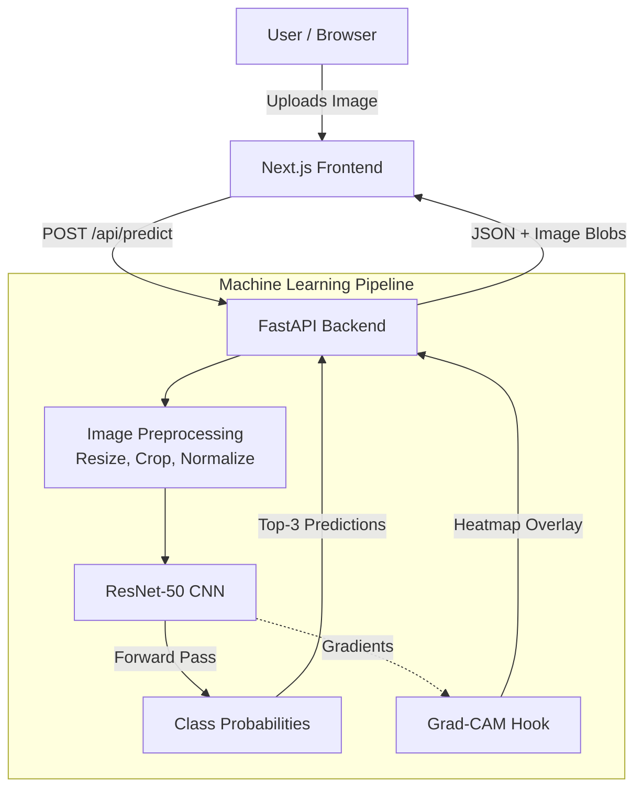

<div align="center">
  
  <h1>🐱 CatVision AI</h1>
  <p><strong>An End-to-End Computer Vision Application for Feline Breed Classification</strong></p>
  
  <p>
    
    
    
    
    
  </p>
</div>

<br />

CatVision AI is a full-stack Machine Learning application that classifies cat breeds from uploaded images in real-time. Rather than acting as a wrapper around a black-box API, this project features a **custom fine-tuned ResNet-50 Convolutional Neural Network** deployed behind a FastAPI backend, and an interactive, highly-polished Next.js frontend.

---

## ✨ Why This Project Stands Out

- **Explainable AI (XAI):** Implements **Grad-CAM** (Gradient-weighted Class Activation Mapping) from scratch to generate visual heatmaps, proving exactly *which* parts of the image the neural network looked at to make its decision.
- **Custom Trained Models:** Features two custom PyTorch model variants (Oxford 12-breed & Gano 15-breed) fine-tuned on custom datasets using Google Colab GPUs.
- **Production-Ready Architecture:** Clean separation of concerns with a decoupled Next.js (React) frontend and FastAPI (Python) backend, fully Dockerized for 1-click cloud deployment.
- **Premium UX/UI:** Butter-smooth animations (Framer Motion), interactive canvas elements (wandering background cats), and responsive drag-and-drop file uploading.

---

## 📸 See It In Action

*(Note to Self: Add high-quality screenshots or GIFs of the app here!)*

| The Upload Interface | Grad-CAM Explainability |
| :---: | :---: |
| `` | `` |

---

## 🏗️ Architecture



---

## 🚀 How to Run Locally

You can run CatVision AI locally either using **Docker** (recommended) or manually by starting the frontend and backend separately.

### Option A: Run with Docker (Easiest)
Ensure you have Docker installed, then simply build and run the multi-stage container:
```bash
# Build the container (this builds the Next.js static files and sets up Python)
docker build -t catvision-ai .

# Run the container on port 7860
docker run -p 7860:7860 catvision-ai
```
> **Access the app at:** `http://localhost:7860`

<br/>

### Option B: Run Manually (For Development)

**1. Start the FastAPI Backend**
```bash
cd backend
python -m venv .venv
# Activate the virtual environment
.venv\Scripts\activate        # Windows
# source .venv/bin/activate   # macOS/Linux

pip install -r requirements.txt
cp .env.example .env
uvicorn app.main:app --reload
```
> The API will start at `http://localhost:8000`

**2. Start the Next.js Frontend**
Open a new terminal window:
```bash
cd frontend
npm install
npm run dev
```
> The UI will start at `http://localhost:3000`

---

## 🧠 Model Training Details

- **Base Architecture:** ResNet-50 (Pretrained on ImageNet).
- **Fine-Tuning:** The final residual block (`layer4`) and fully-connected head were unfrozen and trained.
- **Data Augmentation:** Heavy data augmentation (RandomCrop, HorizontalFlip, RandomRotation, ColorJitter) applied to prevent overfitting on the custom dataset.
- **Optimizer:** Adam with a StepLR scheduler (decaying learning rate every 7 epochs).

---

## 📁 Repository Structure
```
catvision-ai/
├── backend/            # FastAPI server, ML pipelines, and model weights
├── frontend/           # Next.js React application, Tailwind CSS, Framer Motion
├── model/              # PyTorch training and inference scripts
├── tools/              # Utility scripts for asset processing
├── Dockerfile          # Multi-stage build for single-port deployment
└── README.md           # You are here!
```

---
<div align="center">
  <i>Designed and engineered with ❤️</i>
</div>
